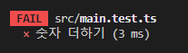

# 1. 개발 환경

## **개발 환경 세팅** <a href="#undefined-2" id="undefined-2"></a>

환경 세팅은 어렵다.

_<mark style="color:red;">왜 why?</mark>_ 개발 환경의 도구들이 시시각각 바뀌므로 그에  대한 대응 능력을 키워야 한다.

1 주차의 첫 강의는 이런 세팅에 대한 노하우를 습득하는 것이 목표이다.


### 1. JavaScript(Node.js) 설치

* _<mark style="color:blue;">**fnm(Fast Node Manager)**</mark>_

> 이전에는 막연히 node를 웹에서 다운로드 하여 설치 하였는데
>
> fnm이란 것을 처음 알게 되었다.&#x20;
>
> 여러 버전의 Node.js를 설치 할 때 fnm을 사용하면 가능하다고 하나
>
> 아직 그게 어떤 이점이 있는 것인지 사실 정확히 체감 되진 않는 것 같다.
>
> 나는 Windows 사용자이기 때문에 Scoop를 사용하여 fnm을 설치해 주었다.
>
> 이후 Node.js의 LTS 최신 버전을 설치 완료했다.

```bash
# scoop를 사용해 fnm 설치.
scoop install fnm

# ~/.bashrc 또는 ~/.zshrc에 다음을 추가
eval "$(fnm env)"

# 설치 가능한 버전 확인.
fnm ls-remote

# LTS(Long Term Support) 버전을 설치하고 기본으로 사용하게 함.
fnm install --lts
fnm use lts-latest
fnm default $(fnm current)

# 설치된 상태 확인.
fnm list
fnm current
```

###

### 2. TypeScript + React + Jest + ESLint + Parcel 개발 환경 세팅

* _<mark style="color:blue;">**작업 폴더 준비**</mark>_

```bash
# 적절한 작업폴더 준비
mkdir my-app
cd my-app
# vscode open
code .
```

* _<mark style="color:blue;">**npm 패키지 준비**</mark>_

```bash
# pakage.json 생성, -y를 통해 귀찮은 질문을 skip 가능하다.
npm init -y
```

* _<mark style="color:blue;">**.gitignore 파일 작성**</mark>_

```gitignore
# 딸려올라가면 안되는 것들을 미연에 방지
/node_modules/
/dist/
/.parcel-cache/

# gitignore.io 또는 github ignore node 에서 필요한 항목들을 복사해서 사용해도 좋다.
```

* _<mark style="color:blue;">**타입 스크립트 설정**</mark>_

> 프로그램에서 직접 사용하는 것이 아닌,&#x20;
>
> 개발 환경에서 사용 되어지는 것이기 때문에&#x20;
>
> pakage.json 파일의 dependencies 가 아닌 devDependencies에 설치한다.

```bash
# 타입스크립트 설치, -D :도구로써 사용할 경우에 붙임
npm i -D typescript

# tsconfig.json 생성
npx tsc --init
```

<figure><figcaption><p>tsconfig.json 파일이 생성 된 후 jsx 부분의 주석 해제를 진행한다.</p></figcaption></figure>

* _<mark style="color:blue;">**ESLint 설정**</mark>_

> ESLint 란? :&#x20;
>
> Lint는 보푸라기란 뜻인데 프로그래밍 쪽에서는 에러가 있는 코드에 표시를 달아 놓는 것을 의미한다. 즉 ESLint는 자바스크립트 문법 중 에러가 있는 곳에 표시를 달아 놓는 도구를 의미한다.

```bash
# ESLint 설치
npm i -D eslint

# .eslintrc.js 생성
npx eslint --init
```

<figure><figcaption><p>.eslintrc.js 파일에서 미리 jest:true를 잡아 주는 것이 좋다.</p></figcaption></figure>


gitignore 파일 작성과 마찬가지로 eslintignore 파일을 작성한다. (내용 동일)



* _<mark style="color:blue;">**React 설정**</mark>_

```bash
# 리액트 설치(*설치중엔 package.js 파일을 건드려선 안된다.)
npm i react react-dom

# 리액트 도구 설치
npm i -D @types/react @types/react-dom
```

* _<mark style="color:blue;">**테스팅 도구 설치**</mark>_

> 강의에 나온 코드를 그대로 복붙하여 설치하니 에러가 발생했었다.
>
> 알고 보니 <mark style="color:red;">터미널 환경</mark>에서 역슬래시(`\`)가 각각 다른 역할을 하기 때문이었고
>
> 터미널에 맞춰 다시 입력하여 설치를 완료 하였다.

```bash
# jest & swc 설치(설치실패)
npm i -D jest @types/jest @swc/core @swc/jest \
    jest-environment-jsdom \
    @testing-library/react @testing-library/jest-dom

# jest & swc 설치(설치성공)
npm i -D jest @types/jest @swc/core @swc/jest 
    jest-environment-jsdom 
    @testing-library/react @testing-library/jest-dom
```

> 설치 이후 jest.config.js 파일을 생성해준다.

```javascript
# jest.config.js 내용 작성

module.exports = {
    testEnvironment: 'jsdom',
    setupFilesAfterEnv: [
      '@testing-library/jest-dom/extend-expect',
    ],
    transform: {
      '^.+\\.(t|j)sx?$': ['@swc/jest', {
        jsc: {
          parser: {
            syntax: 'typescript',
            jsx: true,
            decorators: true,
          },
          transform: {
            react: {
              runtime: 'automatic',
            },
          },
        },
      }],
    },
    testPathIgnorePatterns: [
      '<rootDir>/node_modules/',
      '<rootDir>/dist/',
    ],
  };
```

* _<mark style="color:blue;">**Parcel 설정**</mark>_

```bash
// Some code

npm i -D parcel
```

* _<mark style="color:blue;">**pakage.json "scripts" 수정**</mark>_

```javascript
# script 수정

  "scripts": {
    "start": "parcel --port 8080",
    "build": "parcel build",
    "check": "tsc --noEmit",
    "lint": "eslint --fix --ext .js,.jsx,.ts,.tsx .",
    "test": "jest",
    "coverage": "jest --coverage --coverage-reporters html",
    "watch:test": "jest --watchAll"
  },
```

* 기본 코드 작성

> `-index.html`
>
> `-src/main.tsx`
>
> `-src/App.tsx`
>
> `-src/App.test.tsx`
>
> `-src/components/Greeting.test.tsx`
>
> `-src/components/Greeting.tsx`
